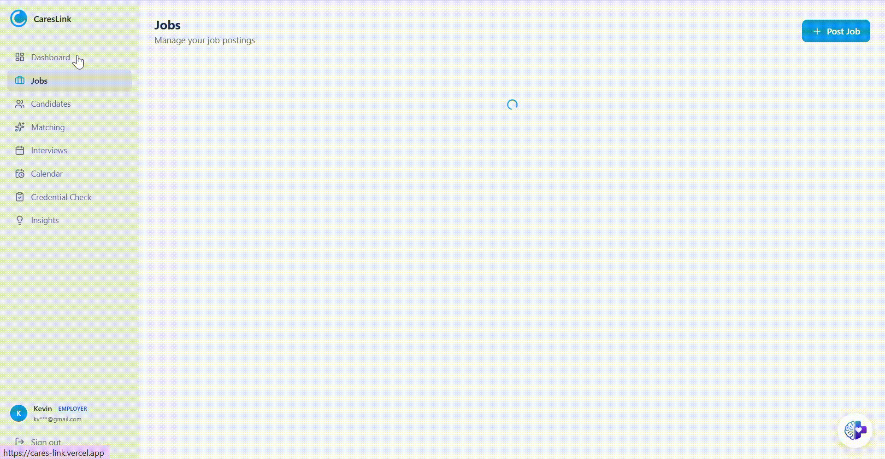

<p align="center">
  
</p>

<h1 align="center">CaresLink</h1>

<p align="center">
  <strong>AI-Powered Healthcare Recruitment Platform</strong><br/>
  Automate your entire hiring pipeline — from sourcing to screening to scheduling — with intelligent agents and real-time insights.
</p>

<p align="center">
  
  
  
  
  
  
</p>

---

## Overview

CaresLink is a production-grade recruitment platform purpose-built for healthcare organizations. It replaces fragmented hiring workflows with a single intelligent system — an AI agent that can schedule interviews, verify credentials, screen candidates, match talent to open roles, and surface data-driven insights, all through natural language.

## Key Features

### AI Recruitment Agent
An Anthropic Claude-powered agent with tool-use capabilities that understands natural language commands. Ask it to book an interview, send a follow-up email, verify a nursing license, or find the best candidate for a role — and it executes end-to-end.

### Credential Verification Engine
Automated multi-source verification for healthcare professionals:
- **Nursys QuickConfirm** — RN/PN license verification with multi-state compact status
- **Florida DOH (MQA)** — Real-time license lookups via browser automation
- **OIG Exclusion List** — Federal fraud and exclusion screening
- **SAM.gov** — Government entity verification

Results are analyzed by Claude to produce an employability recommendation: *Employable*, *Review Required*, or *Not Employable*.

### Smart Interview Scheduling
- Recruiter-defined availability with weekly schedules and date overrides
- Candidate self-service booking via public link
- Google Calendar and Microsoft Outlook integration
- Automatic conflict detection, ICS generation, and timezone handling
- Cron-driven reminders (24h and 1h before) with calendar attachments

### Live Interview Room
- Real-time audio transcription powered by Deepgram
- Waveform visualization via Web Audio API
- Timestamped notes linked to transcript moments
- AI-generated summaries with ratings, strengths, concerns, and next steps

### AI Screening Assistant
Automated conversational screening that guides candidates through structured questions — role interest, experience, availability, work authorization, salary expectations — then generates a summary and flags for recruiter review.

### Intelligent Job Matching
AI-powered compatibility scoring (0–100) that evaluates experience, education, skills, certifications, and interview performance. Each match includes a fit label and a plain-language justification.

### Candidate Profiles & Job Board
LinkedIn-style profiles with work history, education, certifications, licenses, and skills. Candidates browse and auto-apply to open positions with one click, filtered by role, shift, and business unit.

### Recruitment Analytics
- Real-time metrics: candidates, emails sent, response rates, no-show rates, cost per hire, time-to-hire
- 30-day trend analysis with interactive charts
- AI-generated insights: stale candidate alerts, channel effectiveness, cost optimization recommendations

## Tech Stack

| Layer | Technology |
|-------|-----------|
| **Framework** | Next.js 16 (App Router), React 19, TypeScript |
| **Styling** | Tailwind CSS, Framer Motion |
| **Database** | PostgreSQL, Prisma ORM |
| **Auth** | Clerk (OAuth, RBAC with Employer/Candidate roles) |
| **AI** | Anthropic Claude (agent + tool use), Deepgram (speech-to-text) |
| **Calendar** | Google Calendar API, Microsoft Graph |
| **Email** | Resend, SendGrid |
| **Documents** | Puppeteer, pdf-parse, Mammoth, jsPDF |
| **Charts** | Recharts |
| **Testing** | Vitest |

## Architecture

```
src/
├── app/
│   ├── api/                  # RESTful API routes
│   │   ├── agent/            # Claude AI agent endpoints
│   │   ├── booking/          # Public interview scheduling
│   │   ├── candidates/       # Candidate management
│   │   ├── credential-check/ # Multi-source verification
│   │   ├── interviews/       # Interview operations
│   │   ├── jobs/             # Job board & auto-apply
│   │   ├── matching/         # AI job matching engine
│   │   ├── profile/          # Candidate profile CRUD
│   │   ├── screening/        # AI screening assistant
│   │   └── analytics/        # Recruitment metrics
│   ├── candidates/           # Candidate management UI
│   ├── interviews/           # Interview scheduling UI
│   ├── insights/             # Analytics dashboard
│   ├── jobs/                 # Job board
│   └── screening/            # AI screening interface
├── components/               # Shared UI components
└── lib/                      # Core business logic
    ├── ai/                   # Claude agent & tools
    ├── scheduling.ts         # Availability engine
    ├── credentials.ts        # Verification orchestrator
    └── insights.ts           # Analytics engine
```

## Getting Started

### Prerequisites

- Node.js 18+
- PostgreSQL database
- API keys (see below)

### Installation

```bash
# Clone the repository
git clone https://github.com/yourusername/careslink.git
cd careslink

# Install dependencies
npm install

# Configure environment
cp .env.example .env.local
# Edit .env.local with your API keys

# Set up database
npm run db:push
npm run db:seed

# Start development server
npm run dev
```

Open [http://localhost:3000](http://localhost:3000) to access the platform.

### Environment Variables

| Variable | Service | Purpose |
|----------|---------|---------|
| `ANTHROPIC_API_KEY` | [Anthropic](https://console.anthropic.com/) | AI agent & matching |
| `DEEPGRAM_API_KEY` | [Deepgram](https://console.deepgram.com/) | Interview transcription |
| `CLERK_SECRET_KEY` | [Clerk](https://dashboard.clerk.com/) | Authentication |
| `RESEND_API_KEY` | [Resend](https://resend.com/) | Email delivery |
| `STRIPE_SECRET_KEY` | [Stripe](https://dashboard.stripe.com/) | Server-side billing operations |
| `STRIPE_PREMIUM_PRICE_ID` | Stripe | Backward-compatible default paid price |
| `STRIPE_STARTER_PRICE_ID` | Stripe | Starter subscription checkout price (recommended: $9/mo test) |
| `STRIPE_PRO_PRICE_ID` | Stripe | Pro subscription checkout price (recommended: $29/mo test) |
| `STRIPE_WEBHOOK_SECRET` | Stripe | Webhook signature verification |
| `AI_FREE_REQUESTS_PER_DAY` | App config | Server-side free-tier AI daily cap |
| `AI_STARTER_REQUESTS_PER_DAY` | App config | Server-side starter-tier AI daily cap |
| `AI_PRO_REQUESTS_PER_DAY` | App config | Server-side pro-tier AI daily cap |
| `NEXT_PUBLIC_APP_URL` | App config | Return/success URL for checkout + billing portal |
| `DATABASE_URL` | PostgreSQL | Database connection |
| `GOOGLE_CLIENT_ID` | [Google Cloud](https://console.cloud.google.com/) | Calendar integration |
| `AZURE_CLIENT_ID` | [Azure Portal](https://portal.azure.com/) | Outlook integration |

### Stripe Webhook Setup (Windows PowerShell)

If `stripe` is not recognized in PowerShell, call the CLI using its full path:

```powershell
& "$env:LOCALAPPDATA\Microsoft\WinGet\Packages\Stripe.StripeCli_Microsoft.Winget.Source_8wekyb3d8bbwe\stripe.exe" login
& "$env:LOCALAPPDATA\Microsoft\WinGet\Packages\Stripe.StripeCli_Microsoft.Winget.Source_8wekyb3d8bbwe\stripe.exe" listen --forward-to localhost:3000/api/stripe/webhook
```

Important notes:
- Use `api/stripe/webhook` (not `api/webhook`).
- Keep `stripe listen` running while testing checkout.
- Copy the printed `whsec_...` value into `STRIPE_WEBHOOK_SECRET` in `.env`.

Optional alias for the current terminal session:

```powershell
Set-Alias stripe "$env:LOCALAPPDATA\Microsoft\WinGet\Packages\Stripe.StripeCli_Microsoft.Winget.Source_8wekyb3d8bbwe\stripe.exe"
stripe listen --forward-to localhost:3000/api/stripe/webhook
```

### Scripts

```bash
npm run dev          # Start development server
npm run build        # Production build
npm run db:push      # Sync Prisma schema to database
npm run db:seed      # Seed initial data
npm run db:studio    # Open Prisma Studio
npm run test         # Run test suite
npm run test:watch   # Run tests in watch mode
```

## License

MIT
